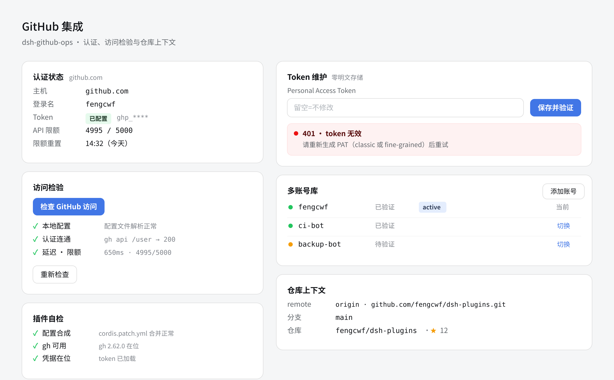

# DESIGN.md — 设计约束（token 化，逐字进实现）

> 变更：`changes/20260929-phase0/`（2026-09-29）。定稿图：`visual/final.png`（候选 3「双栏概览式」，用户 2026-09-29 选定）。
> 设计系统唯一来源 = dsh `--dsw-*` token（`@deepseek-ai/dsh-client-ui-theme`，浅色解析值如下仅作对照）；**实现引用 CSS 变量名，暗色主题自动适配（用户裁定：免暗色参考图）**。
> Design Read：settings-section 双栏概览式（左状态/右管理），工程工具气质，信任优先；三旋钮 VARIANCE 4 / MOTION 2 / DENSITY 5。

## 定稿图

- 布局：左栏=状态概览（认证状态卡、访问检验卡、插件自检卡）；右栏=管理操作（token 维护卡、多账号库卡、仓库上下文卡）。
- 断点：<960px 折叠为单列（左栏在上、右栏在下）；内容列 max-width 1200px 居中，卡间距 16px。

## 色彩 token（color）

| 用途 | CSS 变量（实现引用） | 浅色解析值（对照） |
|------|---------------------|--------------------|
| 画布底 | `--dsw-bg-module-platform` | `#F5F6F7` |
| 卡面 | `--dsw-bg-base` / `--dsw-bg-layer-1` | `#FFFFFF` |
| 边框 l1/l2/l3 | `--dsw-border-l1` / `-l2` / `-l3` | `#0000000A` / `#0000001A` / `#0000001F` |
| 文字 primary | `--dsw-label-primary` | `#0F1115` |
| 文字 secondary | `--dsw-label-secondary` | `#61666B` |
| 文字 tertiary | `--dsw-label-tertiary` | `#81858C` |
| 文字 caption | `--dsw-label-caption` | `#ADB2B8` |
| 主操作/品牌（唯一强调色） | `--dsw-state-business-primary` | `#4176E6`（deepseek-500） |
| 主操作浅底/深字 | `--dsw-state-business-bg` / `-fg` | `#E4EDFD` / `#34415B` |
| 成功（点/浅底/深字） | `--dsw-state-success-*` | `#22C55E` / `#E6FAED` / `#233C2C` |
| 警告（点/浅底/深字） | `--dsw-state-warning-*` | `#F59E0B` / `#FEF5E7` / `#27241F` |
| 错误（点/浅底/描边/深字） | `--dsw-state-error-*` | `#EC1313` / `#FEF2F2` / `#FEE2E2` / `#570C0C` |

- **Color Consistency Lock**：全栏目唯一强调色 `#4176E6`（主按钮/链接/active 徽章），语义色只用于状态点与错误卡。
- 无渐变、无玻璃拟态、无霓虹外发光；禁纯黑 `#000000` 作文本色。

## 字体 token（font）

| 层级 | 字号/行高 | 字重 | 用途 |
|------|-----------|------|------|
| 页面标题 | 20px / 28px | 600 | 「GitHub 集成」 |
| 卡片标题 | 15px / 22px | 600 | 六节标题 |
| 正文/值 | 14px / 22px | 400 | label-value 行 |
| 辅助/说明 | 12px / 18px | 400 | 次要说明、限额窗口 |
| 数值/命令 | 13px mono | 400 | 限额 4995/5000、remote URL、`gh api /user` |

- 字体族：`--dsw-font-family` 系统栈（渲染 Noto Sans CJK SC）；数值列 mono = `--dsw-font-mono`（DejaVu Sans Mono 回退）。
- 中文文案平实功能句；按钮文字单行（「保存并验证」「检查 GitHub 访问」「重新检查」「添加账号」「切换」）。

## 间距 token（spacing）

| 档位 | 值 | 用途 |
|------|-----|------|
| space-1 | 4px | 徽章内距、状态点与文字 |
| space-2 | 8px | label-value 行距、按钮内距 |
| space-3 | 12px | 卡内分组间距 |
| space-4 | 16px | 卡间距、卡内边距下限 |
| space-5 | 24px | 卡内边距、栏间距 |
| space-6 | 32px | 栏目标题下间距 |

## 圆角与阴影

- 圆角一套：`--dsw-radius-xs` 4px（徽章/状态点）/ `--dsw-radius-sm` 8px（输入/按钮）/ `--dsw-radius-md` 12px（卡片）。
- 阴影：卡片仅 `--dsw-shadow-l1`（向背景靠拢，浅底禁纯黑投影）；错误卡用描边 `#FEE2E2` 不叠影。

## 交互状态（实现必做）

- Loading：按钮内联 spinner + 禁用；结果卡骨架（贴合最终布局形状）。
- Error：分级错误卡（401/403/429/超时/gh 缺失/写入失败），卡内文案带修复指引（INV-10，stderr 敏感串不透传）。
- Empty：多账号库空态「尚无其他账号」+ 添加账号入口。
- 触感：`:active` 按钮 `translateY(1px)`；focus ring `--dsw-state-business-primary` 2px。

## 可访问性

- 按钮文字对背景 WCAG AA（白字 `#4176E6` ≈ 4.6:1 ✅）；输入 placeholder `#81858C` 对白底 ≥4.5:1 ✅；状态点不单独承载语义（配文字标签）。

## 禁令清单（taste-skill 适用子集）

- 零 em-dash/en-dash 出现在可见 UI 文案；无 emoji 图标（状态点=CSS 圆点、星标=矢量星形）；无渐变/玻璃拟态/彩虹配色；无三等宽卡堆砌（布局=定稿图双栏非对称）。
